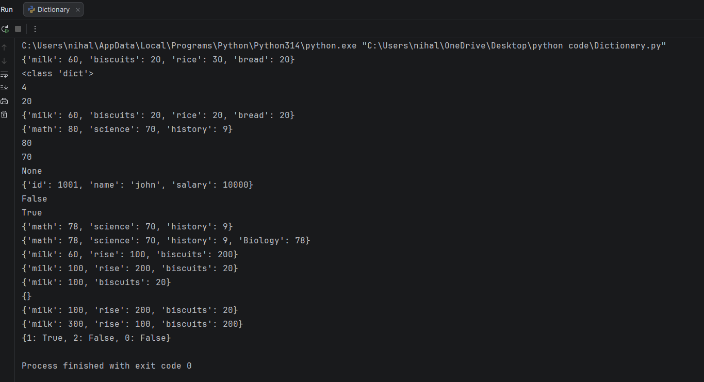

## 🗂️ Dictionaries in Python

This program demonstrates the use of **dictionaries in Python**, which store data as **key–value pairs**.  
It is designed for beginners to understand how dictionaries work, how to access and modify data, and how common dictionary operations are performed.

---

## 📌 Topic Overview

The program covers the following dictionary concepts:

- Creating dictionaries using key–value pairs
- Accessing values using keys
- Updating existing values
- Using dictionary methods such as `get()`, `update()`, `pop()`, and `clear()`
- Checking membership using the `in` operator
- Understanding duplicate keys behavior
- Valid and invalid data types for dictionary keys

---

## 🧪 Code Functionality

The program demonstrates:

- Creation of dictionaries with different data types
- Accessing dictionary values using keys
- Modifying values associated with keys
- Using `get()` to safely access keys that may not exist
- Updating dictionaries with new key–value pairs
- Removing elements using `pop()`
- Clearing all elements using `clear()`
- Membership checking using the `in` operator
- Handling duplicate keys (latest value is retained)
- Valid key types (immutable data types only)

All examples are written in a **simple, structured, and beginner-friendly** manner.

---

## 🧠 Key Concepts Explained

### 🔹 Dictionaries
- Unordered collection of key–value pairs
- Keys must be **unique and immutable**
- Values can be of any data type

### 🔹 Dictionary Operations
- Access values using keys
- Update existing keys or add new ones
- Remove keys and values
- Check if a key exists

### 🔹 Key Rules
- Allowed key types: `str`, `int`, `float`, `bool`, `tuple`
- Not allowed as keys: `list`, `set`, `dict` (mutable types)

---

## 🖥️ Output

The program prints detailed output to the console, including:
- Dictionary contents
- Dictionary type and length
- Accessed values using keys
- Updated dictionary values
- Results of membership checks
- Behavior of duplicate keys

The sample console output is attached below.

> 📌 *The output image (`output.png`) is stored in the same folder as this README.*

---

## 📂 File Information

- **`dictionary.py`** — Python file demonstrating dictionary concepts  
- **`output.png`** — Screenshot of console output  
- **`README.md`** — Documentation for the topic *Dictionaries in Python*  

---

## 👨‍💻 Author

**Nihal Mishra**  
📧 Email: nihalmishra3009@gmail.com  
🌐 GitHub: https://github.com/NihalMishra3009  

---

## ⭐ Note

Understanding dictionaries is essential for:
- Data storage and lookup
- Working with JSON and APIs
- Real-world applications like configuration handling and data mapping

This topic forms a foundation before learning **advanced data structures and file handling**.

---

Happy Learning 🚀  
Master data structures to write efficient Python programs.
