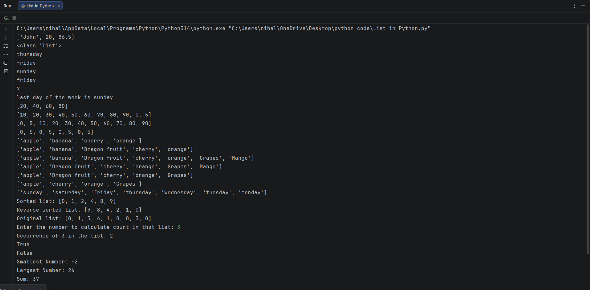

## Python Lists and List Functions – Practice Programs

This folder contains **beginner-focused Python programs** that demonstrate list creation, indexing, slicing, list operations, built-in list functions, membership operators, numerical operations, and nested lists.

The goal is to build a **clear and correct understanding of Python lists**, which are one of the most important data structures in Python.

---

## 📌 Concepts Covered

The programs cover the following topics:

- Creating lists with **multiple data types**  
- Accessing list elements using **positive and negative indexing**  
- Finding the length of a list using `len()`  
- Slicing lists to extract sublists  
- List concatenation using the `+` operator  
- Repetition of lists using the `*` operator  
- Modifying lists (mutable nature of lists)

---

## 🧪 List Functions Demonstrated

The following built-in list methods are demonstrated with examples:

- `append()` – adds an element at the end of the list  
- `insert()` – inserts an element at a specific index  
- `extend()` – adds multiple elements to a list  
- `remove()` – removes the first occurrence of a specified element  
- `pop()` – removes and returns an element using index  
- `reverse()` – reverses the order of elements in the list  
- `sort()` – sorts the list in ascending order  
- `count()` – counts occurrences of a given element  

All examples are written in a **simple, readable, and linear format** for easy understanding.

---

## 🔍 Membership Operations

The programs demonstrate the use of membership operators:

- `in` – checks if an element exists in a list  
- `not in` – checks if an element does not exist in a list  

---

## 🔢 Numerical Operations on Lists

The following numerical operations are covered:

- `min()` – finds the smallest element in a list  
- `max()` – finds the largest element in a list  
- `sum()` – calculates the sum of all elements  

---

## 🧩 Nested Lists

The code also demonstrates **nested lists**, including:

- Accessing inner lists  
- Indexing elements inside nested structures  

---

## 🖥️ Output

Each program prints results directly to the console, showing the effect of each list operation and function step by step.

A sample console output is shown below:

---

## 📂 File Structure

- `lists.py` — Complete practice program covering all list concepts  
- `output.png` — Screenshot of console output  
- `README.md` — Documentation for this folder  

---

## 👨‍💻 Author

**Nihal Mishra**  
📧 Email: nihalmishra3009@gmail.com  
🌐 GitHub: https://github.com/NihalMishra3009  

---

## ⭐ Note

Lists are a **core data structure in Python**.  
A strong understanding of list operations is essential before learning **loops, functions, dictionaries, and advanced data structures**.
