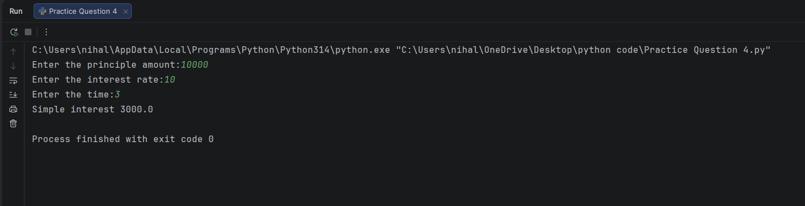

## 💰 Python Practical Question 4 – Simple Interest Calculation

This program demonstrates how to calculate **Simple Interest** using Python.
It helps beginners understand how mathematical formulas can be implemented using basic input, arithmetic operations, and output statements.

---

## 📌 Program Overview

The program calculates **Simple Interest** based on three user-provided values:

- Principal amount (P)
- Rate of interest (R)
- Time duration (T)

The calculated simple interest is then displayed on the console.

---

## 🧮 Formula Used

### 📐 Simple Interest Formula

**Simple Interest = (P × R × T) / 100**

Where:
- **P** = Principal amount  
- **R** = Rate of interest  
- **T** = Time duration  

---

## 🧪 Code Functionality

The program demonstrates:

- Taking numerical input using `input()` and `float()`
- Applying a mathematical formula in Python
- Performing arithmetic calculations
- Displaying results using the `print()` function

All logic is written in a **simple and readable format** for beginners.

---

## 🖥️ Output

After taking user input, the program prints the **calculated simple interest** directly to the console.  
A screenshot of the console output is shown below.

> 📌 *The output image (`output.png`) is stored in the same folder as this README.*

---

## 📂 File Information

- **`simple_interest.py`** — Python file containing Practical Question 4  
- **`output.png`** — Screenshot of console output  
- **`README.md`** — Documentation for this practical program  

---

## 👨‍💻 Author

**Nihal Mishra**  
📧 Email: `nihalmishra3009@gmail.com`  
🌐 GitHub: https://github.com/NihalMishra3009  

---

## ⭐ Note

This practical question helps build a strong understanding of:
- Basic financial calculations  
- Formula-based problem solving  
- User input handling in Python  

It is an essential step before learning **conditional statements and loops**.

---

Happy Learning 🚀  
Strong basics create strong programmers.
