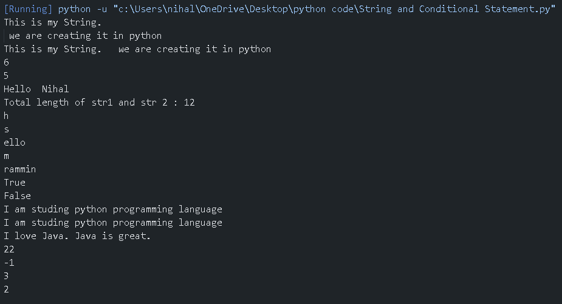

## Python Strings and String Functions – Practice Programs

This folder contains Python programs that demonstrate **string creation, operations, indexing, slicing, escape sequences, and commonly used string functions**.

It is designed for beginners to clearly understand how strings work in Python.

---

## 📌 Program Overview

The programs in this folder cover the following string-related concepts:

- Creating strings using single, double, and triple quotes
- Using escape sequence characters (`\n`, `\t`)
- Finding the length of a string
- String concatenation
- Indexing and slicing strings
- Negative indexing
- Using built-in string functions

The focus is on **clarity, correctness, and fundamentals**.

---

## 🧪 Code Functionality

The programs demonstrate:

### String Creation
- Single-quoted strings
- Double-quoted strings
- Triple-quoted strings (multi-line strings)

### Escape Sequences
- New line using `\n`
- Tab space using `\t`

### Basic String Operations
- Finding string length using `len()`
- Concatenating strings using `+`

### Indexing and Slicing
- Accessing characters using positive indexing
- Accessing characters using negative indexing
- Extracting substrings using slicing

### String Functions
- `endswith()` — checks string ending
- `capitalize()` — capitalizes first character
- `replace()` — replaces substrings
- `find()` — finds index of substring
- `count()` — counts occurrences of substring

All examples are written in a **simple and readable format**.

---

## 🖥️ Output

Each program prints results directly to the console, showing how string operations and functions work in real time.  
The complete console output is shown below.

---

## 📂 File Information

- `strings.py` — Demonstrates string operations and string functions  
- `output.png` — Screenshot of console output  
- `README.md` — Folder documentation  

---

## 👨‍💻 Author

**Nihal Mishra**  
📧 Email: nihalmishra3009@gmail.com  
🌐 GitHub: https://github.com/NihalMishra3009  

---

## ⭐ Note

Strings are a core data type in Python.  
Understanding string operations and functions is essential before working with conditions, loops, and text-based applications.
