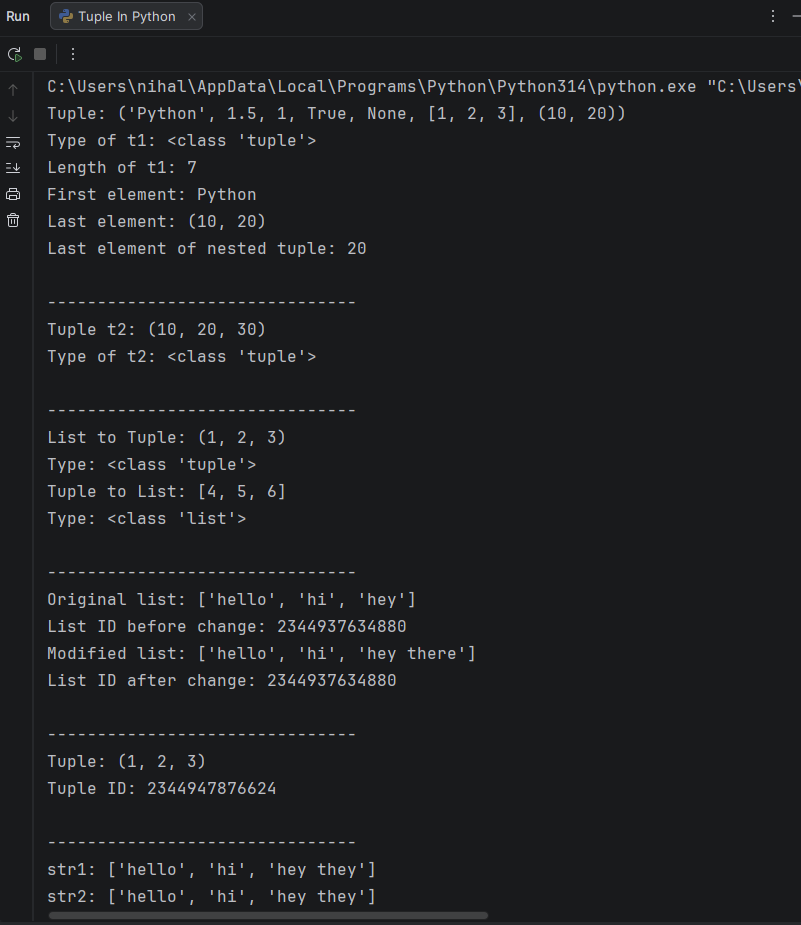

## 📦 Tuples in Python

This program demonstrates the concept of **tuples in Python** and explains how they differ from lists in terms of **ordering, immutability, and memory behavior**.  
It is intended for beginners to clearly understand tuple creation, access, type casting, and the difference between **mutable and immutable data types**.

---

## 📌 Topic Overview

The program covers the following tuple-related concepts:

- Creating tuples with mixed data types
- Accessing tuple elements using indexing
- Tuple packing (without parentheses)
- Converting lists to tuples and tuples to lists
- Understanding mutability vs immutability
- Reference behavior in mutable objects like lists

---

## 🧪 Code Functionality

The program demonstrates:

- Creation of tuples using parentheses
- Accessing elements using positive and negative indexing
- Accessing nested elements inside a tuple
- Tuple packing without parentheses
- Type casting:
  - List → Tuple
  - Tuple → List
- Checking object identity using `id()`
- Comparing behavior of lists (mutable) and tuples (immutable)

All examples are written in a **clear, structured, and beginner-friendly manner**.

---

## 🧠 Key Concepts Explained

### 🔹 Tuples
- Ordered collection of elements
- Can store multiple data types
- Immutable (cannot be changed after creation)

### 🔹 Lists
- Ordered collection of elements
- Mutable (can be modified)
- Changes affect all references pointing to the same list

### 🔹 Mutability vs Immutability
- Lists allow modification of elements
- Tuples do not allow modification once created
- Memory reference (`id`) helps observe object behavior

---

## 🖥️ Output

The program prints detailed output to the console, including:
- Tuple values and their types
- Length of tuples
- Accessed elements using indexing
- Demonstration of mutable vs immutable behavior
- Memory reference comparison using `id()`

The sample console output is attached below.

> 📌 *The output image (`output.png`) is stored in the same folder as this README.*

---

## 📂 File Information

- **`tuples.py`** — Python file demonstrating tuple concepts  
- **`output.png`** — Screenshot of console output  
- **`README.md`** — Documentation for this topic  

---

## 👨‍💻 Author

**Nihal Mishra**  
📧 Email: `nihalmishra3009@gmail.com`  
🌐 GitHub: https://github.com/NihalMishra3009  

---

## ⭐ Note

This topic is essential for understanding:
- Data immutability
- Memory behavior in Python
- Choosing appropriate data structures

It forms a foundation before learning **sets, dictionaries, and advanced data structures**.

---

Happy Learning 🚀  
Strong understanding of basics leads to better coding decisions.
