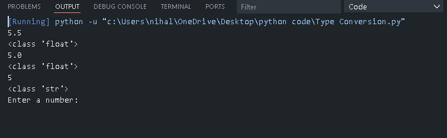

## Type Conversion and Type Casting in Python

This folder contains Python programs that demonstrate **type conversion** and **type casting** in Python using simple and beginner-friendly examples.

It helps learners understand how Python handles different data types during operations and how values can be manually converted when required.

---

## 📌 Program Overview

The programs in this folder focus on the following concepts:

- Automatic type conversion performed by Python
- Manual type casting using built-in functions
- Working with integers, floats, and strings
- Handling user input and converting input data types
- Understanding how data types affect arithmetic operations

---

## 🧪 Code Functionality

The programs demonstrate:

### Type Conversion (Automatic)
- Python automatically converts compatible data types
- Example: Adding an integer and a float results in a float

### Type Casting (Manual)
- Converting values using:
  - `int()`
  - `float()`
  - `str()`
- Converting user input from string to numeric types
- Performing calculations after type casting

### Input Handling
- Understanding that `input()` always returns a string
- Converting input values for mathematical operations
- Checking data types using the `type()` function

All examples are written in a **clear and readable manner** for beginners.

---

## 🖥️ Output

Each program prints the results of type conversion and type casting directly to the console.  
The console output clearly shows how values and their data types change after conversion.

---

## 📂 File Information

- `type_conversion.py` — Demonstrates type conversion and type casting in Python  
- `output.png` — Screenshot of console output  
- `README.md` — Folder documentation  

---

## 👨‍💻 Author

**Nihal Mishra**  
📧 Email: nihalmishra3009@gmail.com  
🌐 GitHub: https://github.com/NihalMishra3009  

---

## ⭐ Note

Type conversion is a fundamental concept in Python.  
Understanding it clearly is essential when working with user input, calculations, and real-world data.
