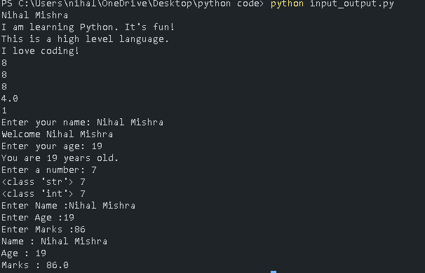

## Python Input and Output – Practice Programs

This folder contains Python programs that demonstrate **basic input and output operations**, including user input, type conversion, and console output using the `print()` function.

It is intended for beginners who are learning how Python interacts with users through the console.

---

## 📌 Program Overview

The programs in this folder cover the following concepts:

- Displaying text and numeric output using `print()`
- Printing multiple values in a single statement
- Performing arithmetic operations and displaying results
- Taking user input using `input()`
- Understanding that `input()` returns a string by default
- Converting input values to `int` and `float`
- Using comments and docstrings for code clarity

The focus is on **clarity, correctness, and fundamentals**.

---

## 🧪 Code Functionality

The programs demonstrate:

### Output in Python
- Printing strings and numbers
- Printing results of arithmetic expressions
- Printing multiple values together

### Input in Python
- Accepting user input using `input()`
- Displaying user-provided data
- Type conversion using `int()` and `float()`
- Verifying data types using `type()`

### Comments and Documentation
- Single-line comments using `#`
- Multi-line documentation using docstrings (`""" """`)

All implementations are beginner-friendly and easy to understand.

---

## 🖥️ Output

Each program interacts with the user through the console and prints the corresponding output.  
The complete console output is captured and displayed below.

---

## 📂 File Information

- `input_output.py` — Demonstrates input, output, and type conversion in Python  
- `output.png` — Screenshot of console output  
- `README.md` — Folder documentation  

---

## 👨‍💻 Author

**Nihal Mishra**  
📧 Email: nihalmishra3009@gmail.com  
🌐 GitHub: https://github.com/NihalMishra3009  

---

## ⭐ Note

Understanding input and output is a foundational step in Python.  
These concepts are essential before moving to conditions, loops, and logic-based programs.
