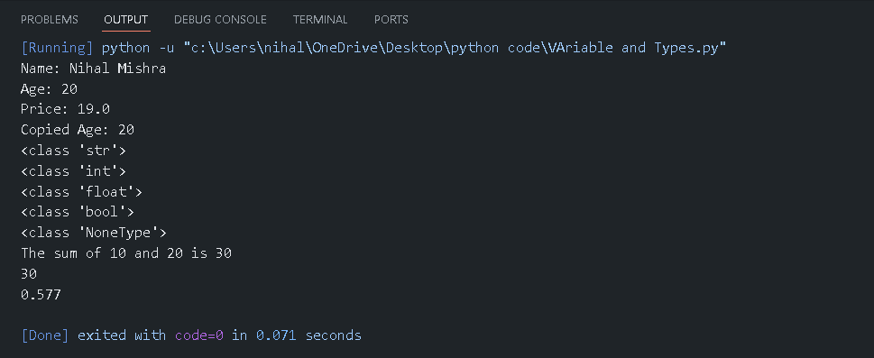

## Python Variables and Data Types – Practice Programs

This folder contains Python programs that demonstrate how variables and built-in data types are defined, assigned, and used in Python.
It is intended for beginners who are building a strong foundation in Python programming and understanding how data is stored and manipulated.

---

## 📌 Program Overview

The programs in this folder cover fundamental concepts related to variables and data types, including:

- Declaring and assigning variables
- Working with common data types such as integers, floats, strings, booleans, and None
- Copying values using assignment operators
- Performing basic arithmetic operations using variables
- Inspecting data types using the `type()` function

Each example focuses on practical usage rather than theoretical explanations.

---

## 🧪 Code Functionality

The programs demonstrate:
- Dynamic typing in Python
- Variable assignment and reassignment
- Basic numeric operations
- Type inspection at runtime
- Clean and readable output formatting

The implementations are intentionally simple and beginner-friendly to reinforce core concepts clearly.

---

## 🖥️ Output

Each program generates console output showing:
- Variable values
- Results of arithmetic operations
- Data types of different variables

The sample output for this module is shown below.

---

## 📂 File Information

- `variables_and_types.py` — Demonstrates variable declaration, data types, assignment, and basic operations  
- `output.png` — Screenshot of console output  
- `README.md` — Folder documentation  

---

## 👨‍💻 Author

Nihal Mishra  
📧 Email: nihalmishra3009@gmail.com  
🌐 GitHub: https://github.com/NihalMishra3009
